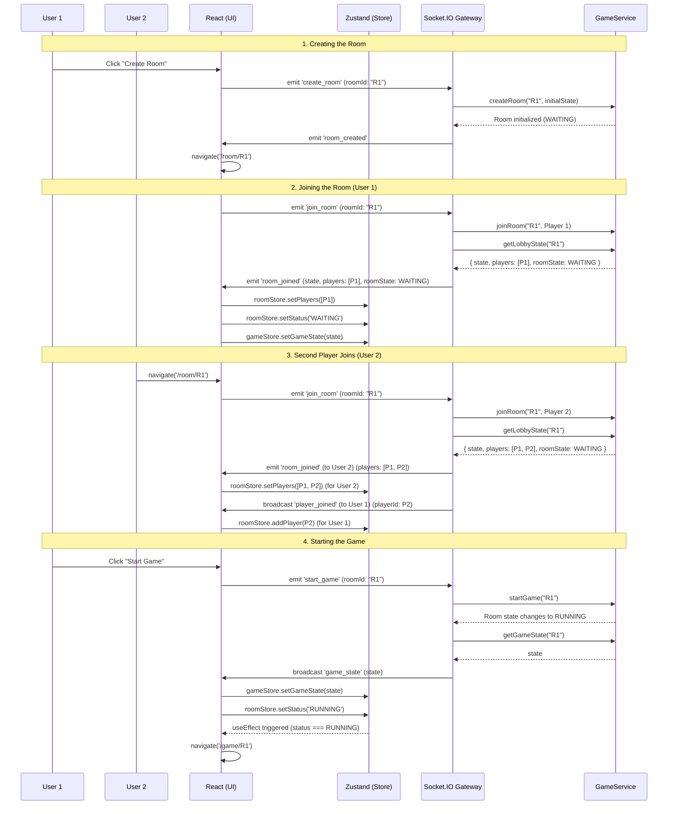

# Monopoly Room Lifecycle

This sequence diagram illustrates the synchronized lifecycle for creating, joining, and starting a Monopoly room.

```mermaid
sequenceDiagram
    participant User 1
    participant User 2
    participant React (UI)
    participant Zustand (Store)
    participant Socket.IO Gateway
    participant GameService

    %% Create Room Flow
    Note over User 1, GameService: 1. Creating the Room
    User 1->>React (UI): Click "Create Room"
    React (UI)->>Socket.IO Gateway: emit 'create_room' (roomId: "R1")
    Socket.IO Gateway->>GameService: createRoom("R1", initialState)
    GameService-->>Socket.IO Gateway: Room initialized (WAITING)
    Socket.IO Gateway->>React (UI): emit 'room_created'
    React (UI)->>React (UI): navigate('/room/R1')

    %% Join Room Flow
    Note over User 1, GameService: 2. Joining the Room (User 1)
    React (UI)->>Socket.IO Gateway: emit 'join_room' (roomId: "R1")
    Socket.IO Gateway->>GameService: joinRoom("R1", Player 1)
    
    Socket.IO Gateway->>GameService: getLobbyState("R1")
    GameService-->>Socket.IO Gateway: { state, players: [P1], roomState: WAITING }
    
    Socket.IO Gateway->>React (UI): emit 'room_joined' (state, players: [P1], roomState: WAITING)
    React (UI)->>Zustand (Store): roomStore.setPlayers([P1])
    React (UI)->>Zustand (Store): roomStore.setStatus('WAITING')
    React (UI)->>Zustand (Store): gameStore.setGameState(state)

    %% Second Player Joins
    Note over User 1, GameService: 3. Second Player Joins (User 2)
    User 2->>React (UI): navigate('/room/R1')
    React (UI)->>Socket.IO Gateway: emit 'join_room' (roomId: "R1")
    Socket.IO Gateway->>GameService: joinRoom("R1", Player 2)
    
    Socket.IO Gateway->>GameService: getLobbyState("R1")
    GameService-->>Socket.IO Gateway: { state, players: [P1, P2], roomState: WAITING }
    
    Socket.IO Gateway->>React (UI): emit 'room_joined' (to User 2) (players: [P1, P2])
    React (UI)->>Zustand (Store): roomStore.setPlayers([P1, P2]) (for User 2)
    
    Socket.IO Gateway->>React (UI): broadcast 'player_joined' (to User 1) (playerId: P2)
    React (UI)->>Zustand (Store): roomStore.addPlayer(P2) (for User 1)

    %% Start Game Flow
    Note over User 1, GameService: 4. Starting the Game
    User 1->>React (UI): Click "Start Game"
    React (UI)->>Socket.IO Gateway: emit 'start_game' (roomId: "R1")
    Socket.IO Gateway->>GameService: startGame("R1")
    GameService-->>Socket.IO Gateway: Room state changes to RUNNING
    
    Socket.IO Gateway->>GameService: getGameState("R1")
    GameService-->>Socket.IO Gateway: state
    
    Socket.IO Gateway->>React (UI): broadcast 'game_state' (state)
    React (UI)->>Zustand (Store): gameStore.setGameState(state)
    React (UI)->>Zustand (Store): roomStore.setStatus('RUNNING')
    
    Zustand (Store)-->>React (UI): useEffect triggered (status === RUNNING)
    React (UI)->>React (UI): navigate('/game/R1')
```
